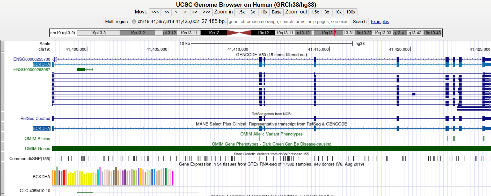
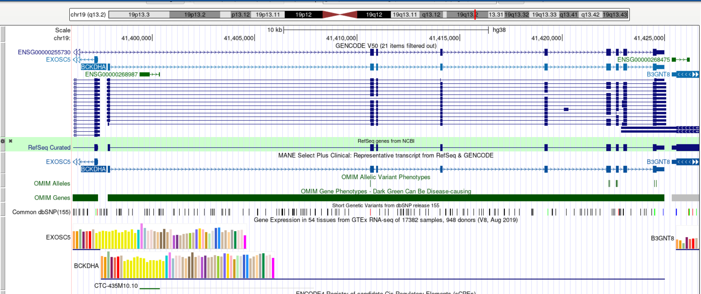
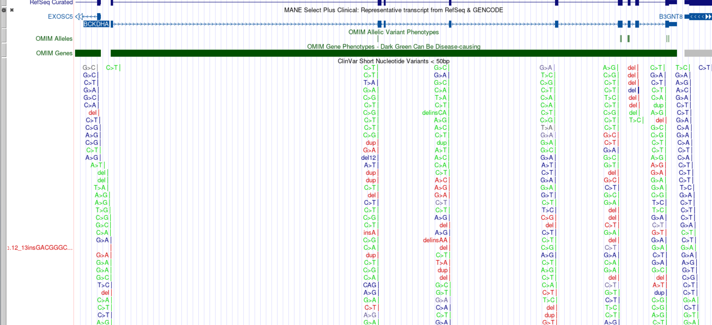
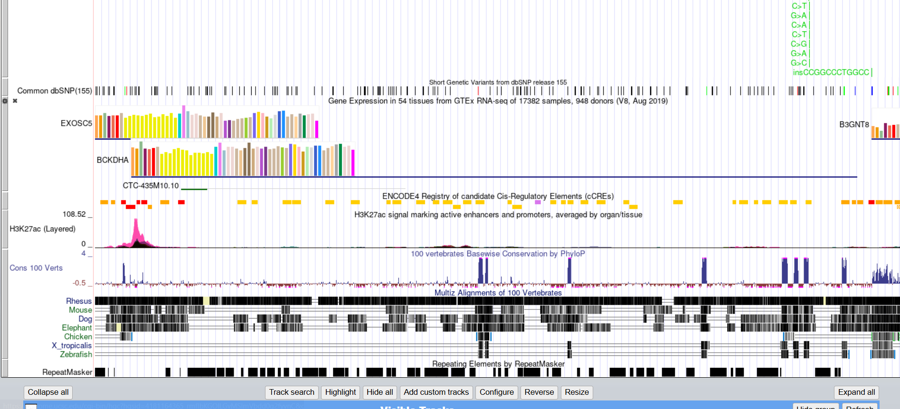
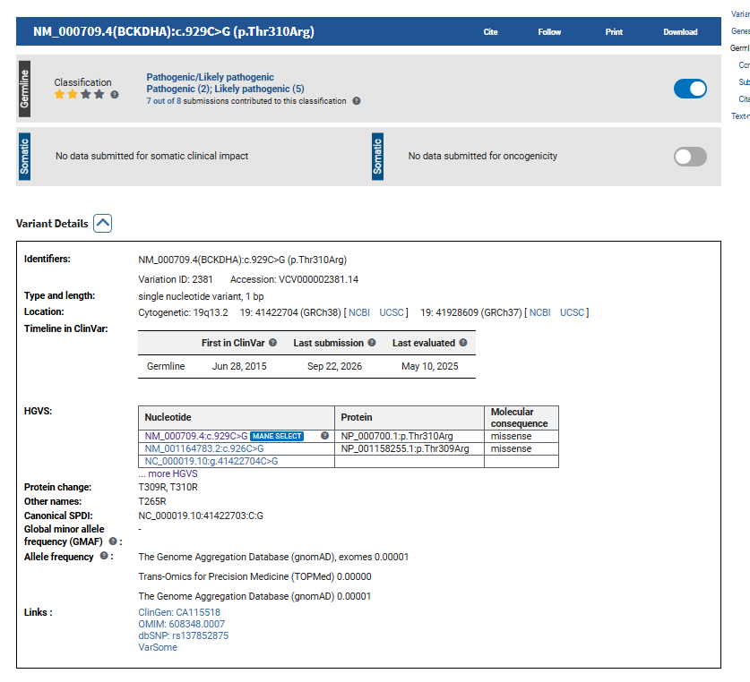
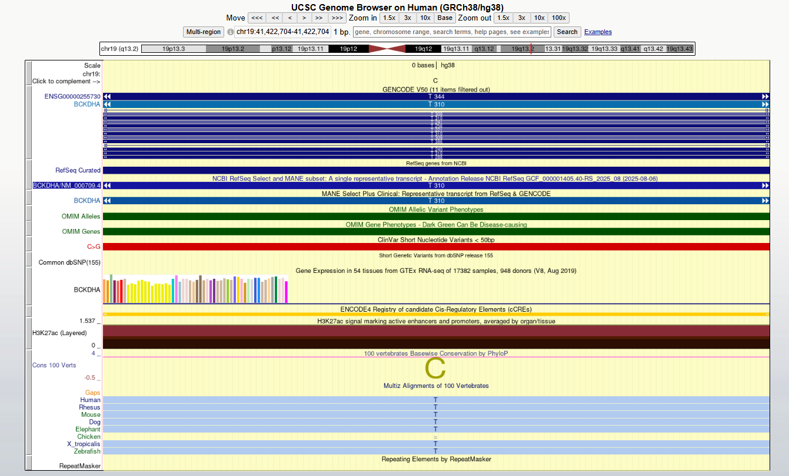

# MSUD BCKDHA Mutation Analysis

## Project Overview

This project investigates **Maple Syrup Urine Disease (MSUD)** and the **BCKDHA** gene. The analysis examines a normal BCKDHA sequence, a documented disease-associated mutation, and a student-created artificial mutation.

The project used **NCBI, Galaxy, SeqKit Translate, UCSC Genome Browser, and ClinVar** to connect DNA sequence changes with predicted protein effects and genomic location.

---

## 1. Disease and Gene

### Maple Syrup Urine Disease (MSUD)

Maple Syrup Urine Disease is an inherited metabolic disorder that affects the breakdown of the branched-chain amino acids **leucine, isoleucine, and valine**. MSUD is inherited in an **autosomal recessive** pattern.

### BCKDHA

- **Gene:** BCKDHA
- **Chromosome:** 19
- **Location:** 19q13.2
- **Reference transcript:** NM_000709.4
- **Reference protein:** NP_000700.1
- **Protein:** 2-oxoisovalerate dehydrogenase subunit alpha

BCKDHA encodes the alpha subunit of the E1 component of the branched-chain alpha-ketoacid dehydrogenase complex.

---

## 2. Objectives

The project aimed to:

1. Obtain the BCKDHA wild-type CDS.
2. Translate the WT CDS into a protein sequence.
3. Analyze a documented BCKDHA mutation.
4. Create an artificial mutation.
5. Compare the resulting sequences and proteins.
6. Locate the documented variant using UCSC.
7. Examine ClinVar and conservation information.

---

# 3. Galaxy Sequence Analysis

## Wild-Type Sequence

The BCKDHA WT coding sequence was obtained from NCBI RefSeq.

| Feature | Result |
|---|---|
| Transcript | NM_000709.4 |
| Protein | NP_000700.1 |
| CDS length | 1,338 bp |
| Protein length | 445 aa |
| Reading frame | Frame 1 |
| Genetic code | Standard |

The WT CDS was translated using **SeqKit Translate** in Galaxy.

**WT protein:** `MSUD_protein.fasta`

---

## Documented Mutation

The documented BCKDHA mutation analyzed was:

**NM_000709.4:c.929C>G (p.Thr310Arg)**

The nucleotide substitution changes:

**ACA → AGA**

This results in:

**Thr310 → Arg310 (T310R)**

| Feature | Result |
|---|---|
| Mutation type | Missense |
| Nucleotide change | C → G |
| Codon change | ACA → AGA |
| Protein change | T310R |
| CDS length | 1,338 bp |
| Protein length | 445 aa |
| Frameshift | No |
| Premature stop | No |

**Documented mutant CDS:** `MSUD_BCKDHA_c929C_G_mutant.fasta`

**Documented mutant protein:** `MSUD_mutant_protein.fasta`

---

## Artificial Mutation

The student-created mutation was:

**c.303G>A**

The codon changes:

**AAG → AAA**

Both codons encode lysine (K), making this a **synonymous mutation**.

| Feature | Result |
|---|---|
| Nucleotide change | G → A |
| Codon change | AAG → AAA |
| Amino-acid change | K → K |
| Mutation type | Synonymous |
| Frameshift | No |
| Premature stop | No |
| Protein length | 445 aa |

**Artificial mutant CDS:** `MSUD_BCKDHA_artificial_c303G_A.fasta`

**Artificial mutant protein:** `MSUD_artificial_mutant_protein.fasta`

---

## Sequence Comparison

| Feature | WT | Documented Mutation | Artificial Mutation |
|---|---|---|---|
| CDS length | 1,338 bp | 1,338 bp | 1,338 bp |
| Protein length | 445 aa | 445 aa | 445 aa |
| Mutation | None | c.929C>G | c.303G>A |
| Codon change | — | ACA → AGA | AAG → AAA |
| Protein change | — | T310R | K → K |
| Mutation type | — | Missense | Synonymous |

The documented mutation changes one amino acid, while the artificial mutation does not change the predicted amino-acid sequence.

---

# 4. UCSC Genome Browser and ClinVar

## BCKDHA Gene Location

The BCKDHA gene was located in the **GRCh38/hg38** human genome assembly on chromosome 19 at approximately **chr19:41,397,818–41,425,002**.

### Figure 1. BCKDHA Gene Location

This figure shows the location of the **BCKDHA** gene in the human genome using the GRCh38/hg38 assembly. The gene is located on chromosome 19 in the 19q13.2 region. The UCSC Genome Browser provides the genomic coordinates and allows the BCKDHA region to be examined together with different gene and genome annotations.

---

## BCKDHA Gene Structure

The UCSC Genome Browser was used to examine the BCKDHA transcript and exon-intron structure.

### Figure 2. BCKDHA Gene Structure

This figure shows the structure of the **BCKDHA** gene in the UCSC Genome Browser. The gene models display the transcript structure and the arrangement of exon and intron regions. Multiple transcript annotations are visible, including RefSeq and GENCODE models, allowing the structure of BCKDHA to be examined in greater detail.

---

## ClinVar and Conservation Tracks

The **ClinVar Short Nucleotide Variants** track and **UCSC 100 Vertebrates** conservation tracks were enabled.

### Figure 3. ClinVar Track

This figure shows the **ClinVar Short Nucleotide Variants** track within the BCKDHA genomic region. The track displays clinically reported small nucleotide variants at different positions. Enabling this track allowed the BCKDHA region to be examined for variants that have been submitted to ClinVar and provided a way to connect the gene region with clinically reported genetic variation.

### Figure 4. BCKDHA Conservation

This figure shows the **UCSC 100 Vertebrates** conservation track for the BCKDHA region. The basewise conservation and multispecies alignment tracks compare the human sequence with sequences from other vertebrates. The displayed alignment provides information about whether nucleotide positions in the region are conserved across species, which can provide additional context when examining a genetic variant.

---

# 5. Selected ClinVar Variant

The selected variant was:

**NM_000709.4(BCKDHA):c.929C>G (p.Thr310Arg)**

| Feature | Result |
|---|---|
| ClinVar Variation ID | 2381 |
| Variant | c.929C>G |
| Protein change | p.Thr310Arg |
| Molecular consequence | Missense |
| GRCh38 position | chr19:41,422,704 |
| Classification | Pathogenic/Likely pathogenic |

### Figure 5. ClinVar Record

 This figure shows the NCBI ClinVar record for **NM_000709.4(BCKDHA):c.929C>G (p.Thr310Arg)**. The record identifies the variant as a single-nucleotide variant with a missense molecular consequence and provides its genomic position on GRCh38. The ClinVar record also displays the reported clinical classification of **Pathogenic/Likely pathogenic** for this variant.

ClinVar:  
https://www.ncbi.nlm.nih.gov/clinvar/variation/2381/

---

# 6. Variant Located in UCSC

The ClinVar variant was located in UCSC using the GRCh38 position:

**chr19:41,422,704**

The position is within the BCKDHA coding region and corresponds to the **T310** position of the protein. The UCSC view also shows the BCKDHA gene model, ClinVar information, and conservation tracks.

### Figure 6. BCKDHA c.929C>G in UCSC

This figure shows the BCKDHA genomic region at **GRCh38 chr19:41,422,704**, the genomic position corresponding to the selected ClinVar variant. The BCKDHA transcript, ClinVar annotation, and conservation tracks are visible in the same browser view. The position corresponds to the region associated with **T310** in the BCKDHA protein, supporting the connection between the genomic variant **c.929C>G** and the reported protein change **p.Thr310Arg**.
---

# 7. Interpretation

### Where is the variant located?

The variant is located within the **BCKDHA gene** on chromosome 19 at GRCh38 position **chr19:41,422,704**.

### Is it coding or non-coding?

The variant is located in the **coding region** because ClinVar reports the protein consequence **p.Thr310Arg** and classifies it as a missense variant.

### How might it affect the protein?

The c.929C>G substitution changes **ACA to AGA**, replacing threonine with arginine at position 310. The protein remains 445 amino acids long, but the amino-acid substitution could affect protein structure, stability, interactions, or activity.

### What additional evidence is needed?

Additional clinical, genetic, biochemical, and functional evidence would be needed to determine the full effect of the variant on BCKDHA function and MSUD.

---

# 8. Reflection

### 1. What did UCSC show that was not obvious from simply reading about BCKDHA?

UCSC showed the physical organization of BCKDHA, including its genomic location, transcript structure, clinical variants, and conservation across species. These details are not obvious from simply reading about the gene's function.

### 2. Why is the exact genomic location useful?

The exact location allows a variant to be connected to a specific gene, transcript, coding region, and other genomic annotations. It also makes it possible to compare the variant with known clinical and conservation information.

### 3. What is one limitation of predicting a variant's effect only from its location?

Genomic location alone cannot show exactly how a mutation affects protein structure or biological activity. Functional and clinical evidence are needed to determine its actual effect.

### 4. What was the most interesting feature of BCKDHA?

An interesting feature was that UCSC allowed the BCKDHA gene structure, ClinVar variants, and conservation information to be viewed together. This made it possible to connect the selected nucleotide variant with its location in the gene.

---

# 9. Conclusion

The analysis demonstrated how a DNA mutation can be followed from its genomic location to its predicted protein consequence.

The documented **BCKDHA c.929C>G** variant changes **ACA to AGA**, producing the predicted **T310R** amino-acid substitution. The artificial **c.303G>A** mutation changes **AAG to AAA** but remains synonymous because both codons encode lysine.

The UCSC Genome Browser and ClinVar provided genomic and clinical context for the documented variant, while Galaxy and SeqKit were used to analyze the sequence and predicted protein consequences.

---

# 10. Galaxy History

**Galaxy History:** `Deguit_MSUD_BCKDHA_Mutation_Lab`

| File | Purpose |
|---|---|
| `MSUD_CDS.fasta.txt` | WT BCKDHA CDS |
| `MSUD_protein.fasta` | WT protein |
| `MSUD_BCKDHA_c929C_G_mutant.fasta` | Documented mutant CDS |
| `MSUD_mutant_protein.fasta` | Documented mutant protein |
| `MSUD_BCKDHA_artificial_c303G_A.fasta` | Artificial mutant CDS |
| `MSUD_artificial_mutant_protein.fasta` | Artificial mutant protein |

---

# 11. References

- NCBI BCKDHA Gene  
  https://www.ncbi.nlm.nih.gov/gene/593

- NCBI ClinVar  
  https://www.ncbi.nlm.nih.gov/clinvar/variation/2381/

- MedlinePlus Genetics — BCKDHA  
  https://medlineplus.gov/genetics/gene/bckdha/

- MedlinePlus Genetics — Maple Syrup Urine Disease  
  https://medlineplus.gov/genetics/condition/maple-syrup-urine-disease/

- GeneReviews — Maple Syrup Urine Disease  
  https://www.ncbi.nlm.nih.gov/books/NBK1319/

- UCSC Genome Browser  
  https://genome.ucsc.edu/

---

## Submission Checklist

- [x] WT CDS
- [x] WT protein
- [x] Documented mutant CDS
- [x] Documented mutant protein
- [x] Artificial mutant CDS
- [x] Artificial mutant protein
- [x] Sequence comparison
- [x] UCSC gene location
- [x] UCSC gene structure
- [x] ClinVar track
- [x] Conservation track
- [x] ClinVar record
- [x] Variant location in UCSC
- [x] Interpretation
- [x] Reflection
- [x] References
